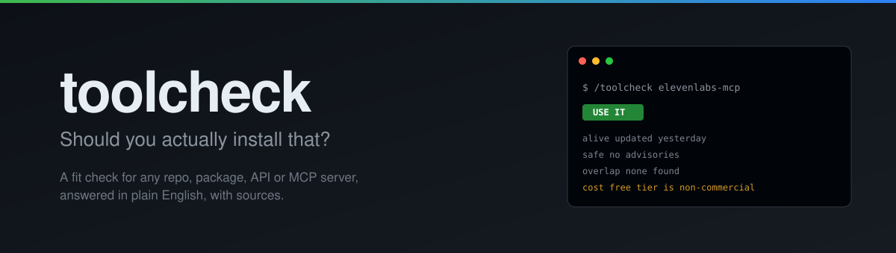
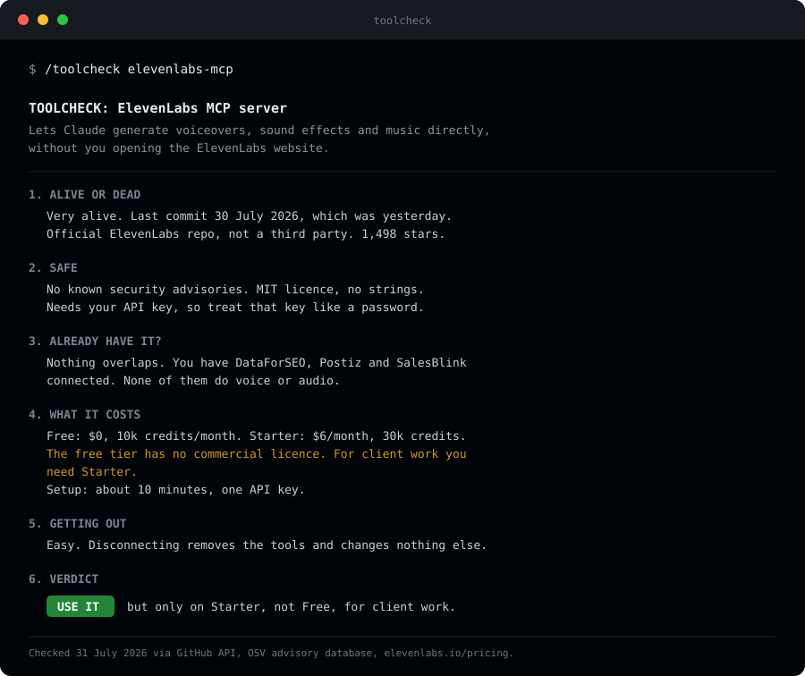
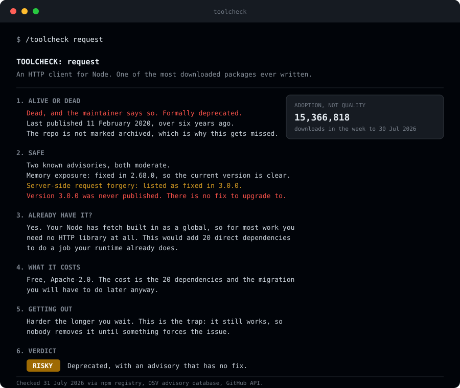
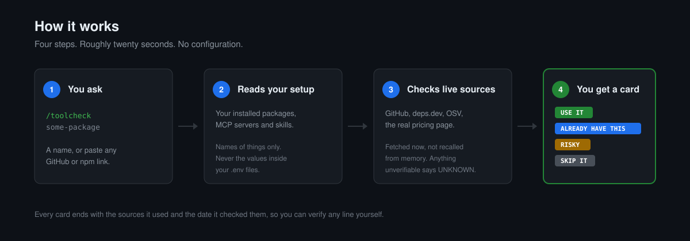

<div align="center">
  

  <p>
    <a href="https://github.com/bhaor/toolcheck/actions/workflows/ci.yml"></a>
    <a href="#install"></a>
    <a href="#works-with"></a>
    <a href="#works-with"></a>
    <a href="LICENSE"></a>
    <a href="https://fallbacklabs.com"></a>
  </p>

  <p><strong>Ask whether a tool is worth adopting. Get a straight answer with sources.</strong></p>

  <p>
    <a href="#the-problem">Problem</a> ·
    <a href="#what-you-get">What you get</a> ·
    <a href="#install">Install</a> ·
    <a href="#catching-it-at-the-moment-you-install">Install-time hook</a> ·
    <a href="#how-it-works">How it works</a> ·
    <a href="#the-rules">Rules</a> ·
    <a href="#limitations">Limitations</a>
  </p>
</div>

---

## The problem

New AI tools arrive faster than anyone can judge them. There are **22,277 GitHub repositories tagged `mcp-server`** and **over 4.2 million packages on npm**, and both counts were lower when this sentence was written. Every day brings another repo, another API, another agent framework, another MCP server, and all of them look good, because the person posting it built it.

Two questions decide whether any of it matters to you:

**Is this actually useful to me?** Not useful in the abstract. Useful for the work you actually do.

**Will it fit what I already have?** Whether it clashes with your setup, and whether you already own something that does this exact job.

Neither question has a fast answer today. The README is written by the seller. Star counts measure popularity, which is not maintenance and is definitely not fit. Ask an AI and it will tell you the last commit was in March, and it may have invented that. So most people install it anyway and find out in six months, once it is load bearing.

Meanwhile every dependency scanner on the market is busy answering a third question: is this package dangerous. That is worth knowing, but it judges the package alone, in a vacuum. None of them know what is already sitting in your project, and that is the part you cannot look up.

**This answers the first two questions.** It reads what you already have, checks the candidate against live sources, and tells you in plain English whether it earns a place in your stack.

<sub>Counts pulled from the GitHub search API and the npm registry on 31 July 2026. Reproduce them: <code>gh api "search/repositories?q=topic:mcp-server" --jq .total_count</code></sub>

## What you get

Ask about anything, get the same six-part card every time.

<div align="center">
  
</div>

Six sections, always in the same order, so by the third time you use it your eye goes straight to the one you care about. Notice section 4 in that example. The free tier has no commercial licence, which is on the pricing page and which nobody reads. That is the sort of thing this exists to catch.

### When the answer is no

That was the easy case. Here is `request`, an HTTP library downloaded over fifteen million times a week.

<div align="center">
  
</div>

Three things in that card are worth pointing at, because they are the reason a quick glance gets this wrong:

- **Its repo is not marked archived.** Maintainers rarely bother. If you check the archived flag, which is the obvious thing to check, this package looks fine.
- **One advisory is listed as fixed in 3.0.0.** Version 3.0.0 was never published. There is nothing to upgrade to, so "there is a fix" is technically true and practically false.
- **Fifteen million weekly downloads.** Popularity is not health, and the card reports them as separate facts rather than letting the big number imply the small one.

## How it works

<div align="center">
  
</div>

## Install

**Claude Code**

```bash
mkdir -p ~/.claude/skills && curl -fsSL https://github.com/bhaor/toolcheck/archive/refs/heads/main.tar.gz | tar -xz --strip-components=2 -C ~/.claude/skills toolcheck-main/skills/toolcheck
```

**Codex**

```bash
curl -fsSL https://raw.githubusercontent.com/bhaor/toolcheck/main/AGENTS.md >> ~/.codex/AGENTS.md
```

That is the whole install. No API keys, no account, no config file. Every source it uses is free and public.

> **There is deliberately no `curl | sh` here.** That pattern pipes a script straight into your shell, which is the exact thing this tool exists to talk you out of. The commands above download a file and unpack it. Nothing executes. If a tool that tells you to check before installing asked you to blind-run its installer, you should not trust it.

## Catching it at the moment you install

The skill answers when you ask. The hook asks on your behalf, at the point where the decision actually happens.

```bash
mkdir -p ~/.claude/hooks && curl -fsSL https://raw.githubusercontent.com/bhaor/toolcheck/main/hooks/toolcheck-hook.py -o ~/.claude/hooks/toolcheck-hook.py
```

Then add this to `~/.claude/settings.json`:

```json
{
  "hooks": {
    "PreToolUse": [
      {
        "matcher": "Bash",
        "hooks": [
          { "type": "command", "command": "python3 ~/.claude/hooks/toolcheck-hook.py" }
        ]
      }
    ]
  }
}
```

Now when the agent reaches for `npm install some-package`, or `git clone` on a repo you have not used before, the hook notices and asks for a card before it runs.

It watches `npm`, `pnpm`, `yarn`, `bun`, `pip`, `uv`, `poetry`, `cargo`, `go get`, `claude mcp add`, and `git clone`. Cloning is on that list deliberately, because for most people it is the *first* move when sizing up a new tool rather than the last.

**It never blocks.** It only adds a note, and the command proceeds. A gate that interrupts a working session gets switched off within a week, so this one does not interrupt. It also stays quiet for packages already in your `package.json`, since reinstalling something you already depend on is not a new decision.

Needs Python 3.7 or newer, which includes the 3.9 that macOS ships by default.

## Usage

```bash
/toolcheck elevenlabs-mcp
/toolcheck https://github.com/someone/some-repo
/toolcheck fastapi
/toolcheck "that thing everyone keeps posting about"
```

It handles npm packages, PyPI packages, GitHub repos, MCP servers, CLI tools and paid APIs. You can paste a link or type a name.

Comparing two things works too:

```bash
/toolcheck zod vs yup
```

## The four verdicts

Every card ends with exactly one of these. There is no score, because a score invites you to argue with the arithmetic instead of reading the evidence.

| Verdict | What it means |
|---|---|
| **USE IT** | Maintained, no known security problems, nothing you own already does this, cost is clear. |
| **YOU ALREADY HAVE THIS** | Something in your setup covers it. The card names the specific thing and says whether the new one is genuinely better or merely different. |
| **RISKY** | An unfixed security advisory, abandoned with nobody to take over, wants far more access than the job needs, or the publisher cannot be confirmed. |
| **SKIP IT** | Everything else not worth your afternoon. Too expensive, too much setup, solves a problem you do not have. |

## Where the facts come from

| What | Source |
|---|---|
| Versions, publish dates | npm registry, PyPI |
| Licences, dependencies, linked repo | [deps.dev](https://deps.dev) |
| Security advisories | [OSV](https://osv.dev) |
| Commits, maintainers, archived status | GitHub API |
| Pricing | The product's own pricing page, fetched at the time of asking |

All free, all public, none of them need a key.

## The rules

These are the constraints that make the output trustworthy. They are in the skill itself, not just in this README.

**No source, no claim.** If a fact cannot be fetched, the card says `UNKNOWN`. It never estimates a commit date or a download count. `UNKNOWN` appearing regularly is the point. It is what lets you believe the lines that are filled in.

**Your machine stays yours.** It reads the *names* of your dependencies, MCP servers and environment variables. It never reads the values inside your `.env` file.

**Fetched text is information, not instruction.** A README is written by whoever made the tool, and occasionally by someone hoping an AI will read it and comply. Anything fetched is treated as data to analyse. If a page contains text aimed at the reading agent, telling it to score the tool well, the card reports that fact, because a tool that does this has told you something worth knowing.

**Nothing gets executed.** It never runs an install script or the package itself. It only reads.

**The threshold is yours.** Deciding that fourteen months without a commit counts as abandoned is a judgment call, not a measurement. So the card states the measurement and the line it crossed, separately, and you get to disagree with the line.

## Works with

| | Status |
|---|---|
| Claude Code (terminal, desktop, IDE) | Supported |
| Claude Code on the web | Supported |
| Codex CLI | Supported via `AGENTS.md` |
| Anything else that reads markdown instructions | Probably fine, untested |

## Limitations

Worth knowing before you rely on it.

- **It tells you what is knowable, not whether you will enjoy using it.** Ergonomics, documentation quality and whether the API feels right are not in here.
- **Overlap detection only sees what it can see.** If you subscribe to something outside the machine you are on, say so and it will factor that in.
- **Overlap is best effort, not a guarantee.** Shared npm keywords are strong evidence two packages do the same job, and that catches pairs like `zod` and `joi`. But plenty of packages declare no keywords at all, including `yup` and `date-fns`, so the signal goes quiet exactly where you would most want it. A card saying nothing overlaps means nothing was found, not that nothing exists.
- **A clean card is not a safety guarantee.** Malicious packages get published faster than advisory databases catalogue them. "No known problems" means exactly that.
- **Newly published tools look thin.** Something released last week has no track record, and the card will say so rather than pretend otherwise. That is correct behaviour, but it does mean genuinely good new tools can read as unproven.
- **Pricing pages change.** The card is accurate on the day it was run. The date is printed at the bottom for that reason.

## If it got something wrong about your project

This is an automated summary of public data, not a security audit and not a judgment about anyone's work. It reads registries and advisory databases and reports what they say on the day you ask.

If a card is wrong about something you maintain, [open an issue](https://github.com/bhaor/toolcheck/issues) and it gets fixed. Please paste the card, because the fix is usually in how a signal is read rather than in the data itself. The `archived` flag problem above was found exactly that way.

## Contributing

Issues and pull requests welcome. Improvements to the thresholds are especially welcome, because those are the arguable part and the defaults are only a starting point.

See [CONTRIBUTING.md](CONTRIBUTING.md).

## Licence

MIT. See [LICENSE](LICENSE).

---

```
███████╗ █████╗ ██╗     ██╗     ██████╗  █████╗  ██████╗██╗  ██╗
██╔════╝██╔══██╗██║     ██║     ██╔══██╗██╔══██╗██╔════╝██║ ██╔╝
█████╗  ███████║██║     ██║     ██████╔╝███████║██║     █████╔╝ 
██╔══╝  ██╔══██║██║     ██║     ██╔══██╗██╔══██║██║     ██╔═██╗ 
██║     ██║  ██║███████╗███████╗██████╔╝██║  ██║╚██████╗██║  ██╗
╚═╝     ╚═╝  ╚═╝╚══════╝╚══════╝╚═════╝ ╚═╝  ╚═╝ ╚═════╝╚═╝  ╚═╝
██╗      █████╗ ██████╗ ███████╗
██║     ██╔══██╗██╔══██╗██╔════╝
██║     ███████║██████╔╝███████╗
██║     ██╔══██║██╔══██╗╚════██║
███████╗██║  ██║██████╔╝███████║
╚══════╝╚═╝  ╚═╝╚═════╝ ╚══════╝
```

**Built by [Fallback Labs](https://fallbacklabs.com)**

We build AI systems for marketing teams. If this saved you from a bad install, come say hello at **[fallbacklabs.com](https://fallbacklabs.com)**.
